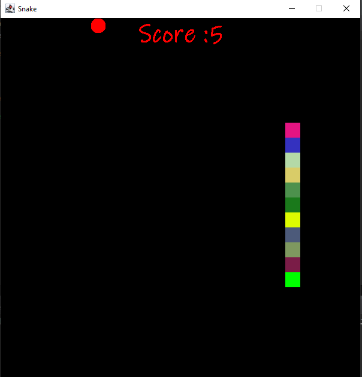

# Java_Snake_Game 🐍
## About This Project
Snake is an older classic video game. It was first created in late 70s. Later it was brought to PCs. In this game the player controls a snake. The objective is to eat as many apples as possible. Each time the snake eats an apple its body grows. The snake must avoid the walls and its own body.In event that the player loses,the score which is continuously accumulated is displayed on the screen.
This project is a fully functional 
## Technologies Used
* Eclipse IDE
* JDK
* Swing for GUI
* AWT for APIS
## How To Install And Run Project
* Ensure the aforementioned tools are setup
* Just download the SnakeGame ".txt"  files in this repository and run in your IDE
* Run it 
* Start playing with the arrows keys. 
* If you lose, just close it and re-run the source code
 ## GamePlay
 * Use the arrow keys to control the snake's movement: up, down, left, and right.
 * The snake will automatically move in the current direction.
 * Try to eat as many apples as possible to increase your score and snake length.
 * Avoid hitting the boundaries or the snake's own body, as it will result in game over.
  ## Screenshot
  
 
## Found A bug?
If you find an issue or you would like to submit an improvement to this project,please submit an issue using the issues tab above.
## Licenses
Feel free to clone, modify, and experiment with this code to enhance the game or learn more about Java game development.
## Acknowledgements
This project was completed with assistance of a YouTube tutorial.Below is a link to be up to speed with the code written in this repository.
<a href="https://youtu.be/bI6e6qjJ8JQ">Link to Video</a>

  
